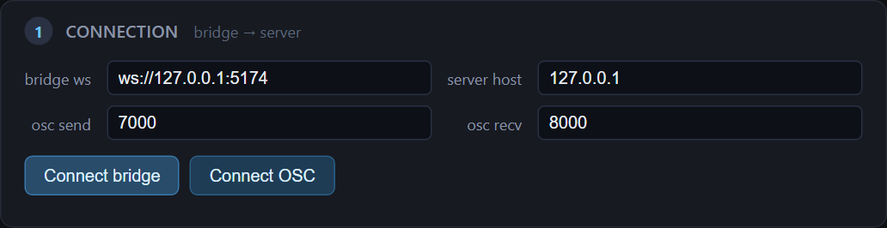
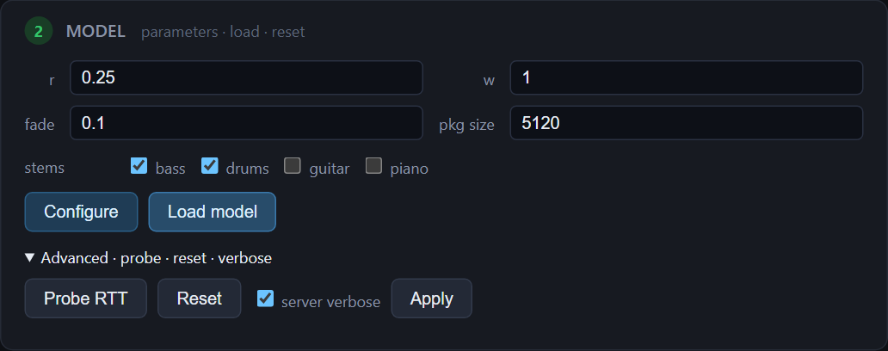
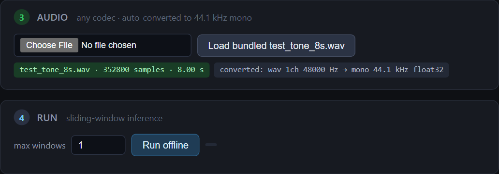
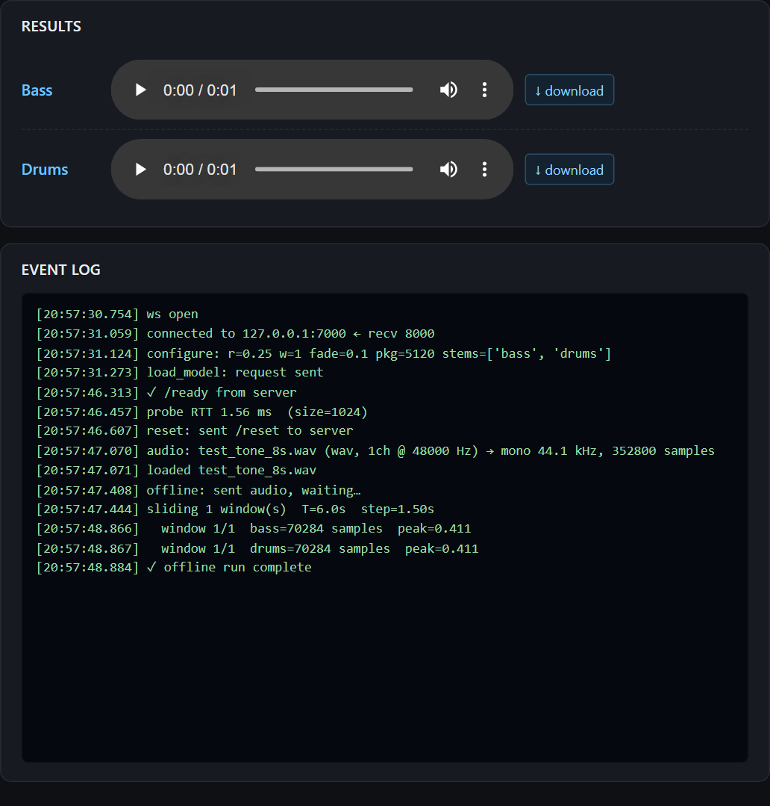
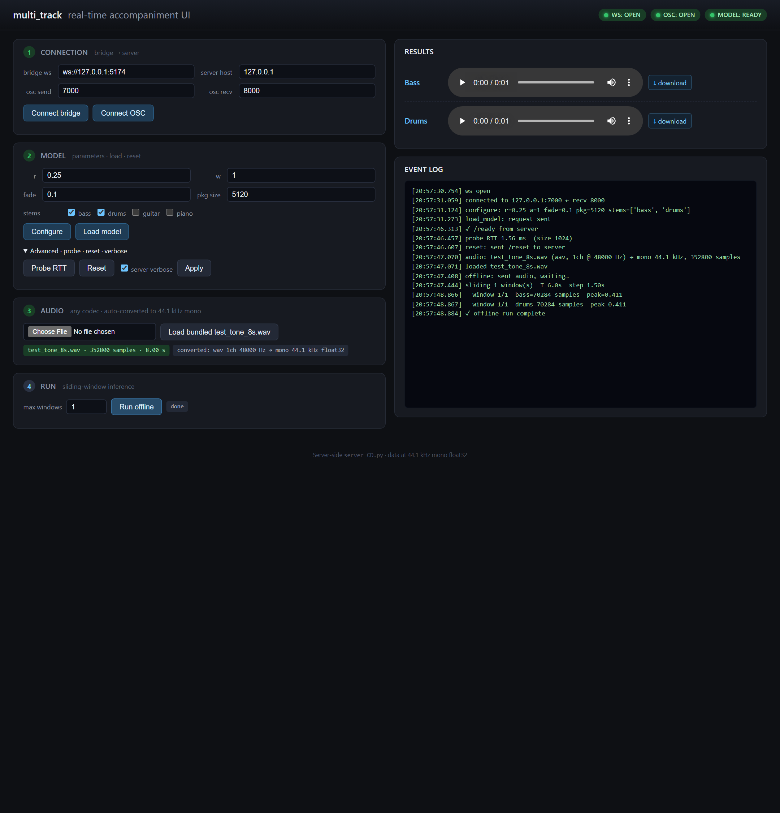

# AI Accompaniment — Real-Time Musical Agent

> **Paper:** *Towards Real-Time Musical Agents: Instrumental Accompaniment with Latent Diffusion Models and MAX/MSP*
> **Authors:** Tornike Karchkhadze, Shlomo Dubnov — University of California San Diego
> **Demo page:** <https://consistency-separation.github.io/>
> **arXiv:** *(link in the ML repo README)*

This repository is the full AI Accompaniment workspace: the model-training and inference backend plus every first-party client currently used to drive it.

If you are new here, you are getting four distinct ways to use the system today:

- a browser app / web app for upload-and-run workflows
- a JUCE client that builds as both a standalone desktop app and a VST3 plugin
- a Python reference client for protocol validation and smoke testing
- the original MAX/MSP client, kept as a legacy compatibility path during the migration

The project started as a MAX-first research system. It is now being reshaped into a multi-client stack where the browser app and the JUCE client are the primary user-facing paths, while MAX remains in the tree for compatibility, patch parity, and research continuity.

This workspace bundles the shared backend and those client surfaces:

| Folder | Role | Language |
|---|---|---|
| [multi_track/](multi_track/) | MAX/MSP **frontend** — a Max external that captures live audio, sends it to the server, and writes the predicted stems back into a `buffer~` | C++ (Max SDK + oscpack) |
| [musical-accompaniment-ldm/](musical-accompaniment-ldm/) | Python **backend** — trains and serves the Latent Diffusion Model (LDM) and its Consistency-Distilled (CD) counterpart | Python 3.10 (PyTorch / Lightning) |
| [clients/python_ref/](clients/python_ref/) | **Reference Python client** — executable spec of [`PROTOCOL.md`](PROTOCOL.md); headless WAV→stems smoke test | Python (stdlib + numpy + soundfile) |
| [clients/web_ui/](clients/web_ui/) | **Browser UI** — HTTP+WebSocket bridge over the reference client, with upload / transport / live event log | Python bridge + vanilla JS |
| [clients/juce_plugin/](clients/juce_plugin/) | **VST3 + Standalone plugin** — 5-bus real-time plugin built on JUCE 8 | C++20 (JUCE) |
| [tests/playwright/](tests/playwright/) | **End-to-end tests** — drive the browser UI headfully via Playwright | Python (pytest + playwright) |

All of those clients speak the same OSC protocol to the Python server. Historically that live loop ran only through MAX/MSP. In the current repo, the same backend can also be exercised through the browser app, the reference Python client, and the JUCE VST3 / standalone app.

---

## Table of Contents

1. [System Overview](#1-system-overview)
2. [Repository Layout](#2-repository-layout)
3. [Model & Method](#3-model--method)
4. [Real-Time Sliding-Window Protocol](#4-real-time-sliding-window-protocol)
5. [OSC Wire Protocol (Max ↔ Python)](#5-osc-wire-protocol-max--python)
6. [Quick Start — End-to-End](#6-quick-start--end-to-end)
7. [Backend — `musical-accompaniment-ldm`](#7-backend--musical-accompaniment-ldm)
8. [Frontend — `multi_track` (Max external)](#8-frontend--multi_track-max-external)
9. [Clients — Python / Web / JUCE](#9-clients--python--web--juce)
10. [Testing — Playwright end-to-end](#10-testing--playwright-end-to-end)
11. [Evaluation](#11-evaluation)
12. [Checkpoints](#12-checkpoints)
13. [Acknowledgments](#13-acknowledgments)
14. [Citation](#14-citation)

---

## 1. System Overview

<p align="center">
  
</p>

- **Client layer:** the legacy MAX external, the browser app / web app, the Python reference client, and the JUCE standalone / VST3 client all speak the same backend protocol.
- **Backend (Python server):** loads the trained model, receives context chunks over OSC, runs denoising (diffusion) or 1–2-step inference (consistency distillation), and returns the predicted stems.
- **Transport:** OSC/UDP — client→Python on port **7000**, Python→client on port **8000**.

The system supports two backends that share the same wire protocol:

| Server | Script | Inference | Intended use |
|---|---|---|---|
| Diffusion (LDM) | [`musical-accompaniment-ldm/server.py`](musical-accompaniment-ldm/server.py) | Iterative denoising | Quality reference / non-real-time |
| Consistency Distillation (CD) | [`musical-accompaniment-ldm/server_CD.py`](musical-accompaniment-ldm/server_CD.py) | 1–2 steps | Real-time |

---

## 2. Repository Layout

```
AI_Accompaniment/
├── PROTOCOL.md                     # Authoritative OSC wire-protocol spec
├── pytest.ini
├── .vscode/settings.json           # Pins Pylance at the ldm venv
│
├── multi_track/                    # MAX/MSP external (C++)
│   ├── multi_track.cpp             # source for the external
│   ├── CMakeLists.txt              # used by the Max SDK build
│   └── multi_track/                # the installable Max package
│       ├── externals/              # compiled .mxe64 (Win) / .mxo (macOS)
│       ├── help/multi_track.maxhelp
│       └── docs/refpages/multi_track.maxref.xml
│
├── musical-accompaniment-ldm/      # Python backend
│   ├── server.py                   # OSC server — diffusion model
│   ├── server_CD.py                # OSC server — consistency-distilled model
│   ├── train_audio.py              # trains the diffusion (LDM) models
│   ├── main_audio_ctm.py           # trains the consistency-distilled models
│   ├── main/                       # data loading, model, evaluation
│   ├── audio_diffusion_pytorch_/   # vendored diffusion backbone
│   ├── ctm/                        # Consistency Trajectory Model code
│   ├── configs/                    # training + server configs
│   └── environment*.yaml           # Linux / Windows / macOS conda envs
│
├── clients/
│   ├── python_ref/                 # Reference Python client — protocol spec as code
│   │   ├── test_client.py
│   │   └── README.md
│   ├── web_ui/                     # Browser UI + OSC↔WS bridge
│   │   ├── bridge.py               # HTTP (5173) + WS (5174) bridge
│   │   ├── index.html              # single-page UI
│   │   └── README.md
│   └── juce_plugin/                # JUCE 8 VST3 / Standalone
│       ├── CMakeLists.txt
│       ├── Source/                 # PluginProcessor, PluginEditor, OscBridge, …
│       └── README.md
│
└── tests/
    └── playwright/                 # Headful E2E test of the full stack via the web UI
        ├── test_smoke.py
        └── smoke_result.png        # screenshot from the last passing run
```

---

## 3. Model & Method

<p align="center">
  
</p>

1. **Encoder.** Input audio mix is encoded to a latent by a pre-trained [Music2Latent](https://github.com/SonyCSLParis/music2latent) autoencoder.
2. **Diffusion backbone.** A U-Net (~**257 M** parameters) performs iterative denoising in the latent space.
3. **Lookahead / inpainting.** A masked variant conditions on partial future context so the model can anticipate the next window rather than only react.
4. **Consistency Distillation (CD).** The diffusion model is distilled into a consistency student that maps noisy inputs to consistent estimates in **1–2 steps**, trained with a combined consistency + denoising-score-matching loss under an EMA teacher. This is what makes the MAX/MSP loop real-time.
5. **Decoder.** Predicted latent → audio via the Music2Latent decoder → back to Max.

---

## 4. Real-Time Sliding-Window Protocol

<p align="center">
  
</p>

Accompaniment is generated as a sliding window over a context of length **T** samples, advancing by **T·r** at each step:

- `T` — context window length (samples)
- `r` — step size as a fraction of `T` (`0 < r ≤ 1`)
- `w` — prediction regime (where the predicted window sits relative to the context)

| `w` | Regime | Meaning |
|---:|---|---|
| `-1` | Retrospective | Predict the window *before* the current context |
| ` 0` | Immediate | Predict the current window (overlap with context) |
| `+1` | Lookahead | Predict the window *after* the context (requires inpainting-trained model) |

Max coordinates used by the external (per the source header in [multi_track.cpp](multi_track/multi_track.cpp)):

- Read context from buffer: `curr → curr + T`
- Write prediction to buffer: `curr + w·r·T → curr + (w+1)·r·T` (with a configurable `fade` cross-fade on write-back)

---

## 5. OSC Wire Protocol (Max ↔ Python)

> The wire protocol is fully specified in **[PROTOCOL.md](PROTOCOL.md)**. What follows is the in-README summary.

UDP, default ports: **client → Python = 7000**, **Python → client = 8000**.

> **Server upgrade (v1.1, 2026-04):** `/ready` now fires **twice** — once after the socket bind, and again after `/load_model` finishes reading the checkpoint. The previous behaviour (fire once, silent reload) is still in place for backward compatibility; new clients can simply gate on the second `/ready` instead of using an RTT timeout. The `/reset` handler now also clears per-batch counters so a reconnecting client with a restarted `batch_id` counter is not treated as a duplicate.

### Messages the external sends (Max → Python)

These are the methods registered by `multi_track.cpp`:

| Message | Arg(s) | Purpose |
|---|---|---|
| `set_command <cmd…>` | symbols | Store the command used to launch / SSH the server |
| `server <0\|1>` | int | Stop / start the Python server process |
| `set_buffer <name>` | symbol | Bind to a multichannel `buffer~` (one channel per stem) |
| `set_send_mode <0\|1>` | int | `0` = sum non-target channels (small packets); `1` = send each channel separately |
| `T <n>` | int | Context window length (samples) |
| `r <f>` | float | Step fraction of `T` |
| `w <f>` | float | Prediction regime (`-1`, `0`, `+1`) |
| `fade <n>` | float | Fade-in length on prediction write-back (samples) |
| `live_mode <0\|1>` | int | Toggle live/offline behavior |
| `packet_size <n>` | int | Max OSC packet size for chunked sends |
| `predict_instruments <list>` | symbols | Subset of `bass drums guitar piano` to predict |
| `port_sender <n>` / `port_listener <n>` | int | Override OSC ports |
| `load_model` | — | Push current params to server and load model weights |
| `predict <curr>` | int | Read context at cursor `curr`, send, wait, write back |
| `test_packet` | — | Round-trip packet test |
| `print` / `reset` / `get_client_ip` / `verbose <n>` | — | Diagnostics |

### Messages the server sends (Python → Max)

| OSC address | Payload | Meaning |
|---|---|---|
| `/ready <bool>` | bool | Server socket is bound and model is loaded |
| `/server_predicted <bool>` | bool | Inference for the last `predict` is complete |
| `/bass <index> <float[]>` | int, floats | Predicted bass chunk |
| `/drums <index> <float[]>` | int, floats | Predicted drums chunk |
| `/guitar <index> <float[]>` | int, floats | Predicted guitar chunk |
| `/piano <index> <float[]>` | int, floats | Predicted piano chunk |
| `/packet_test_response <size> <float[]>` | int, floats | Reply to `test_packet` |

### macOS UDP caveat

macOS caps UDP datagrams at 9216 bytes — too small for audio chunks. The external prompts for admin rights on first load to raise it to 65535. To make it permanent:

```bash
echo "net.inet.udp.maxdgram=65535" | sudo tee -a /etc/sysctl.conf
```

---

## 6. Quick Start — End-to-End

### 6.1  On the **server** machine (GPU recommended)

```bash
# clone + enter the ML repo
cd musical-accompaniment-ldm

# create the conda env for your OS
conda env create -f environment.yaml          # Linux
# conda env create -f environment_windows.yaml  # Windows
# conda env create -f environment_mac_m.yaml    # Apple Silicon
conda activate ctm_gen

# mandatory post-install (evaluation deps)
pip install --no-deps ssr-eval
pip install --no-deps "audioldm-eval @ git+https://github.com/haoheliu/audioldm_eval.git@8dc07ee7c42f9dc6e295460a1034175a0d49b436"

# download checkpoints into ./lightning_logs/ (see section 10)

# start the real-time (consistency-distilled) server
python server_CD.py --serverport 7000 --clientport 8000 --server_ip <SERVER_IP>
# or the full diffusion server:
# python server.py   --serverport 7000 --clientport 8000 --server_ip <SERVER_IP>
```

### 6.2  On the **client** machine — pick one

You have four ways to drive the server. All four speak the same OSC protocol (see [PROTOCOL.md](PROTOCOL.md)).

#### 6.2.a  MAX/MSP (original, for performers)

1. Copy the `multi_track/multi_track/` folder into `Documents/Max 8/Packages/`.
2. Restart Max. On macOS, approve the UDP limit bump on first launch.
3. Open `multi_track.maxhelp` in Max.
4. In the help patch, point the external at the server IP/ports and send:
   - `set_buffer <name>` — your multichannel buffer~
   - `T`, `r`, `w`, `fade`, `send_mode`, `predict_instruments …`
   - `server 1` → `load_model`
5. Drive `predict <curr>` from your transport to stream accompaniment back into the buffer.

#### 6.2.b  Web UI (easiest)

```powershell
# from repo root, in the backend venv
.\musical-accompaniment-ldm\.venv\Scripts\python.exe clients\web_ui\bridge.py
```

Then open <http://127.0.0.1:5173/>. Click **Connect bridge → Connect OSC → Configure → Load model → Load bundled test_tone_8s.wav → Run offline**. Stems arrive as downloadable / playable WAVs. See [clients/web_ui/README.md](clients/web_ui/README.md).

<table>
  <tr>
    <td width="50%"></td>
    <td width="50%"></td>
  </tr>
  <tr>
    <td><sub><strong>Connection.</strong> Bridge WebSocket, OSC send port, and OSC receive port are configured directly in the first card.</sub></td>
    <td><sub><strong>Model controls.</strong> Prediction parameters, stem selection, model load, probe, reset, and verbose toggles are all available before a run.</sub></td>
  </tr>
</table>

#### 6.2.c  Reference Python client (headless smoke test)

```powershell
.\musical-accompaniment-ldm\.venv\Scripts\python.exe clients\python_ref\test_client.py offline `
    --input test_tone_8s.wav --max-windows 1 --verbose
```

See [clients/python_ref/README.md](clients/python_ref/README.md).

#### 6.2.d  JUCE VST3 / Standalone (for DAWs)

Build with CMake + VS 2022 once (`clients/juce_plugin/`), then drop the `.vst3` into your host's plugin folder. See [clients/juce_plugin/README.md](clients/juce_plugin/README.md).

---

## 7. Backend — `musical-accompaniment-ldm`

### 7.1  Dataset — Slakh2100 @ 44.1 kHz

Four stems (bass, drums, guitar, piano). Splits are assigned by track number per the Slakh convention:

| Split | Track range | Count |
|---|---|---|
| train | `Track00001`–`Track01500` | ~1500 |
| validation | `Track01501`–`Track01875` | ~375 |
| test | `Track01876`–`Track02100` | ~225 |

**Full dataset (~100 GB):**

```bash
python main/prepare_dataset/prepare_slakh.py \
    --splits train validation test \
    --dest dataset/slakh2100_44100
```

**BabySlakh (~880 MB, 16 kHz — pipeline smoke test only):**

```bash
python main/prepare_dataset/prepare_slakh.py \
    --splits train \
    --dest dataset/slakh2100_44100_tiny \
    --tiny
```

### 7.2  Training

The repo ships four configs covering {diffusion, consistency} × {maskless, masked/inpainting}:

```bash
# Maskless diffusion
python train_audio.py    --cfg configs/generation/Diff_latent_cond_gen_concat_train.yaml

# Masked diffusion (supports lookahead w = +1)
python train_audio.py    --cfg configs/generation/Diff_latent_cond_gen_concat_inpaint_train.yaml

# Maskless consistency distillation
python main_audio_ctm.py --cfg configs/generation/CD/CD_latent_cond_gen_concat_train.yaml

# Masked consistency distillation (real-time + lookahead)
python main_audio_ctm.py --cfg configs/generation/CD/CD_latent_cond_gen_concat_inpaint_train.yaml
```

Lightning writes checkpoints and logs to `lightning_logs/`.

### 7.3  Serving

`server.py` and `server_CD.py` read their model configs from `configs/for_server/` and expose the OSC interface defined in [§5](#5-osc-wire-protocol-max--python).

```bash
python server.py    --serverport 7000 --clientport 8000 --server_ip <SERVER_IP>
python server_CD.py --serverport 7000 --clientport 8000 --server_ip <SERVER_IP>
```

### 7.4  Platform notes

- **Windows.** `flash-attn`, `xformers`, and `triton` have no pre-built wheels and are skipped; the code automatically falls back to `torch.nn.functional.scaled_dot_product_attention`.
- **Apple Silicon.** Set `PYTORCH_ENABLE_MPS_FALLBACK=1` and use `--device mps` for evaluation.
- **Python** 3.10.

---

## 8. Frontend — `multi_track` (Max external)

### 8.1  Install the precompiled package (users)

Copy `multi_track/multi_track/` into `Documents/Max 8/Packages/` and restart Max. The package includes:

- `externals/multi_track.mxe64` — Windows x64 build
- `externals/multi_track.mxo` — macOS (Intel + Apple Silicon) build
- `help/multi_track.maxhelp` — interactive help patch (start here)
- `docs/refpages/multi_track.maxref.xml` — Max reference documentation

### 8.2  Build from source (developers)

The external depends on the [Max SDK](https://github.com/Cycling74/max-sdk) and [oscpack 1.1.0](https://github.com/RossBencina/oscpack). Clone the SDK, place `multi_track.cpp` at `max-sdk-main/source/advanced/multi_track/`, then:

**Windows (Visual Studio 2022):**

```bat
:: 1. Build oscpack for x64 (Debug + Release)
cmake -S "path\to\max-sdk-main\oscpack_1_1_0" ^
      -B "path\to\max-sdk-main\oscpack_1_1_0\build" ^
      -G "Visual Studio 17 2022" -A x64
msbuild "path\to\max-sdk-main\oscpack_1_1_0\build\oscpack.vcxproj" /t:Rebuild /p:Configuration=Debug   /p:Platform=x64
msbuild "path\to\max-sdk-main\oscpack_1_1_0\build\oscpack.vcxproj" /t:Rebuild /p:Configuration=Release /p:Platform=x64

:: 2. Build the external
::    Open max-sdk-main\build\max-sdk-main.sln, select Release | x64, Build Solution
```

**macOS (Xcode + CMake):**

```bash
cd max-sdk-main
git clone https://github.com/RossBencina/oscpack oscpack_1_1_0
mkdir oscpack_1_1_0/build && cd oscpack_1_1_0/build
cmake .. -DCMAKE_OSX_ARCHITECTURES="x86_64;arm64" \
         -DCMAKE_BUILD_TYPE=Release \
         -DCMAKE_POLICY_VERSION_MINIMUM=3.5
make

cd ../..
mkdir -p build && cd build
cmake .. -G Xcode
# open max-sdk-main/build/max-sdk-main.xcodeproj, select Release, Cmd+B
```

Copy the resulting `multi_track.mxe64` / `multi_track.mxo` into `multi_track/multi_track/externals/`.

---

## 9. Clients — Python / Web / JUCE

All three live under [clients/](clients/) and speak the OSC protocol in [PROTOCOL.md](PROTOCOL.md). They share the same defaults: server `127.0.0.1:7000`, recv `8000`, `r=0.25`, `package_size=5120`, `fade=0.02`, stems `bass + drums`.

### 9.1  Reference Python client — [`clients/python_ref/`](clients/python_ref/)

Stdlib + numpy + soundfile. Doubles as the protocol's executable specification.

```powershell
# Round-trip probe
.\musical-accompaniment-ldm\.venv\Scripts\python.exe clients\python_ref\test_client.py probe

# Offline sliding-window run
.\musical-accompaniment-ldm\.venv\Scripts\python.exe clients\python_ref\test_client.py offline `
    --input my_song.wav --out-dir out\ --stems bass drums --max-windows 4 --verbose
```

Full options and protocol walk-through: [clients/python_ref/README.md](clients/python_ref/README.md).

### 9.2  Web UI — [`clients/web_ui/`](clients/web_ui/)

Two processes: the **bridge** ([`bridge.py`](clients/web_ui/bridge.py)) exposes an OSC-wrapping WebSocket (`ws://127.0.0.1:5174`) and serves the **single-page UI** at `http://127.0.0.1:5173/`. The browser uploads audio, renders live event logs, and plays back / downloads predicted stems — no native install.

```powershell
# Start the bridge (uses the same venv as the server)
.\musical-accompaniment-ldm\.venv\Scripts\python.exe clients\web_ui\bridge.py
#  http   listening on http://127.0.0.1:5173/
#  ws     listening on ws://127.0.0.1:5174/ws
```

The UI is the **recommended path** for development — it exercises the whole stack with visible status pills for `ws/osc/model`, and every button is wired with `data-testid` hooks so Playwright can drive it headfully (see [§10](#10-testing--playwright-end-to-end)).

<table>
  <tr>
    <td width="50%"></td>
    <td width="50%"></td>
  </tr>
  <tr>
    <td><sub><strong>Audio ingest and run.</strong> The browser path accepts browser-decodable audio, shows the normalization result, and exposes the sliding-window run trigger in the same flow.</sub></td>
    <td><sub><strong>Results and event log.</strong> Generated stems stay playable and downloadable in-place while the event log exposes the exact protocol and inference timeline.</sub></td>
  </tr>
</table>

### 9.3  JUCE plugin — [`clients/juce_plugin/`](clients/juce_plugin/)

5-bus VST3 + Standalone (Bass / Drums / Guitar / Piano / Mix-dry) built on **JUCE 8.0.4**. Uses `juce::OSCSender` / `juce::OSCReceiver`, a lock-free mono context ring, and per-stem output FIFOs consumed from `processBlock`.

Build (Windows, VS 2022):

```powershell
cd clients/juce_plugin

# first time only — fetch JUCE
git clone --depth 1 --branch 8.0.4 https://github.com/juce-framework/JUCE.git JUCE

cmake -S . -B build -G "Visual Studio 17 2022" -A x64
cmake --build build --config Release --target AiAccompaniment_VST3 AiAccompaniment_Standalone
```

Artefacts:

- `build/AiAccompaniment_artefacts/Release/VST3/AI Accompaniment.vst3` — drop into `%CommonProgramFiles%\VST3`
- `build/AiAccompaniment_artefacts/Release/Standalone/AI Accompaniment.exe`

Full DAW wiring & troubleshooting: [clients/juce_plugin/README.md](clients/juce_plugin/README.md).

---

## 10. Testing — Playwright end-to-end

The full stack is verified headfully through the browser UI. One test in [tests/playwright/test_smoke.py](tests/playwright/test_smoke.py) drives the complete happy path: *connect bridge → connect OSC → configure → load model → wait for `/ready` → probe → reset → load bundled `test_tone_8s.wav` → run one window → verify both stem downloads are present*.

### 10.1  Setup (one-time)

```powershell
.\musical-accompaniment-ldm\.venv\Scripts\python.exe -m pip install playwright pytest-playwright websockets
.\musical-accompaniment-ldm\.venv\Scripts\python.exe -m playwright install chromium
```

### 10.2  Run

Start the two services (server + bridge) in the background, then run pytest:

```powershell
# server + bridge (leave these running)
Start-Process .\musical-accompaniment-ldm\.venv\Scripts\python.exe -ArgumentList "server_CD.py" `
  -WorkingDirectory "musical-accompaniment-ldm"
Start-Process .\musical-accompaniment-ldm\.venv\Scripts\python.exe -ArgumentList "clients\web_ui\bridge.py"

# run the headful test (opens a visible Chromium window)
.\musical-accompaniment-ldm\.venv\Scripts\python.exe -m pytest tests/playwright -s -v
```

Expected runtime ≈ 20 s when the model is already loaded on the GPU, ≈ 40 s from a cold start. A screenshot of the last UI state is written to [tests/playwright/smoke_result.png](tests/playwright/smoke_result.png).

<p align="center">
  
  <br />
  <sub><strong>Passing end-to-end state.</strong> The Playwright smoke flow finishes with live status pills, a loaded model, normalized audio, generated stems, and a populated event log in a single visible UI.</sub>
</p>

Override the default headful behaviour only in CI:

```powershell
$env:PW_HEADLESS = "1"
.\musical-accompaniment-ldm\.venv\Scripts\python.exe -m pytest tests/playwright -v
```

---

## 11. Evaluation

`main/eval/generate_eval.py` replays the sliding-window inpainting pipeline **offline** on the Slakh test split and computes:

- **COCOLA** — accompaniment quality
- **Beat F1** — via [Beat This](https://github.com/CPJKU/beat_this) (default) or [Beat Transformer](https://github.com/zhaojw1998/Beat-Transformer) (`--method beat_transformer`)
- **FAD** — vggish / pann / clap / encodec embeddings (via `audioldm_eval`)

The evaluation pipeline is adapted from [Streaming Generation for Music Accompaniment](https://github.com/lukewys/stream-music-gen).

### 11.1  One-time evaluation model downloads

```bash
# COCOLA
mkdir -p lightning_logs/stream_music_gen/eval_models/cocola_models
gdown 1S-_OvnDwNFLNZD5BmI1Ouck_prutRVWZ \
      -O lightning_logs/stream_music_gen/eval_models/cocola_models/checkpoint-epoch=87-val_loss=0.00.ckpt

# (optional) Beat Transformer
mkdir -p lightning_logs/stream_music_gen/eval_models/beat_transformer_models
wget -O lightning_logs/stream_music_gen/eval_models/beat_transformer_models/fold_4_trf_param.pt \
  https://github.com/zhaojw1998/Beat-Transformer/raw/main/checkpoint/fold_4_trf_param.pt
```

Beat This and FAD weights are fetched automatically on first run.

### 11.2  Run

```bash
python main/eval/generate_eval.py \
    --config configs/for_server/Diff_latent_cond_gen_concat_eval.yaml \
    --r 0.25 --w 0 \
    --num_samples 1024 \
    --device cuda:0 \
    --stems bass drums guitar piano
```

Apple Silicon:

```bash
PYTORCH_ENABLE_MPS_FALLBACK=1 python main/eval/generate_eval.py \
    --config configs/for_server/Diff_latent_cond_gen_concat_eval.yaml \
    --r 0.25 --w 0 --num_samples 1024 --device mps \
    --stems bass drums guitar piano
```

---

## 12. Checkpoints

[](https://doi.org/10.5281/zenodo.19045462)

Download into `musical-accompaniment-ldm/lightning_logs/`:

```bash
cd musical-accompaniment-ldm/lightning_logs
wget https://zenodo.org/record/19045462/files/checkpoints.tar.gz
tar -xzf checkpoints.tar.gz
rm checkpoints.tar.gz
```

The archive contains the two checkpoints referenced by the `configs/for_server/` YAMLs:

- `GEN_diffusion_model/.../checkpoints/last.ckpt` — masked diffusion model
- `GEN_CD/.../checkpoints/last.ckpt` — masked consistency-distilled model

---

## 13. Acknowledgments

This work builds on the following open-source projects:

- [Sony CTM](https://github.com/sony/ctm) — consistency trajectory models
- [Multi-Source Diffusion Models](https://github.com/gladia-research-group/multi-source-diffusion-models)
- [Audio Diffusion PyTorch (v0.43)](https://github.com/archinetai/audio-diffusion-pytorch)
- [Music2Latent](https://github.com/SonyCSLParis/music2latent) — latent audio codec
- [Streaming Generation for Music Accompaniment](https://github.com/lukewys/stream-music-gen) — evaluation pipeline
- [oscpack](https://github.com/RossBencina/oscpack) — OSC implementation used by the Max external
- [Cycling '74 Max SDK](https://github.com/Cycling74/max-sdk)

---

## 14. Citation

If this system or code is useful in your research, please cite the paper:

```bibtex
@inproceedings{karchkhadze2026realtime,
  title   = {Towards Real-Time Musical Agents: Instrumental Accompaniment with Latent Diffusion Models and MAX/MSP},
  author  = {Karchkhadze, Tornike and Dubnov, Shlomo},
  year    = {2026},
  note    = {See the project README in musical-accompaniment-ldm for the canonical BibTeX.}
}
```

**Contact:** Tornike Karchkhadze — <tkarchkhadze@ucsd.edu>

---

*The Max external is released under the Max SDK license. See each sub-repository's `LICENSE`/README for full terms.*
