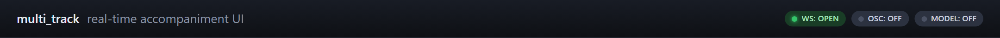

# Ghost Note — Browser App / Web UI

## Overview

This directory contains the browser client for Ghost Note. It is a Python bridge process and a single-page HTML front end that together expose the Ghost Note OSC protocol to a web browser, so a user can configure the inference server, upload or stream audio, and receive the predicted stems without installing MAX/MSP or a DAW.

<p align="center">
  
  <br />
  <sub>The header pills expose the three client states the rest of the UI depends on: WebSocket bridge connected, OSC transport connected, and model loaded.</sub>
</p>

The directory provides:

- a no-build browser interface for configuring the server and running sliding-window accompaniment
- a Python bridge that translates browser actions into the shared OSC protocol
- an offline upload-and-run workflow for validating the model stack without MAX or a plugin host

Two processes make up the web client:

- **[`bridge.py`](bridge.py)** — a Python bridge that re-uses [`clients/python_ref/test_client.py`](../python_ref/test_client.py) as its OSC engine and exposes it to the browser over:
  - HTTP **5173** — serves [`index.html`](index.html) and the static assets.
  - WebSocket **5174** — JSON-RPC channel for every interaction (`connect`, `configure`, `load_model`, `reset`, `verbose`, `probe`, `offline`).
- **[`index.html`](index.html)** — a single-page UI. No build step, no framework.

The browser never speaks OSC directly; the bridge is the only thing that talks UDP to the Python inference server. That keeps the browser free from native permissions, and it also means the UI gets the same `/ready`, `/batch_dropped`, and stem-delivery semantics as the reference client with no duplication.

---

## 1. Install

One-time, into the backend venv:

```powershell
.\musical-accompaniment-ldm\.venv\Scripts\python.exe -m pip install websockets
```

(`numpy` and `soundfile` are already installed for the reference client.)

## 2. Run

Start the inference server first (see [`../../README.md#6-quick-start--end-to-end`](../../README.md#6-quick-start--end-to-end)), then:

```powershell
.\musical-accompaniment-ldm\.venv\Scripts\python.exe clients\web_ui\bridge.py
#  http   listening on http://127.0.0.1:5173/
#  ws     listening on ws://127.0.0.1:5174/ws
```

Open <http://127.0.0.1:5173/>.

<table>
  <tr>
    <td width="50%"></td>
    <td width="50%"></td>
  </tr>
  <tr>
    <td><sub><strong>Connection card.</strong> The bridge WebSocket endpoint and OSC routing are configured explicitly so the browser path stays transparent about transport setup.</sub></td>
    <td><sub><strong>Model card.</strong> The server parameters, stem toggles, load action, probe, reset, and verbose controls are grouped into one operational surface.</sub></td>
  </tr>
</table>

## 3. UI walkthrough

| Step | Button / field | What it does |
|---|---|---|
| 1 | **Connect bridge** | Opens the WebSocket to `ws://127.0.0.1:5174/ws`. The pill on the top left turns green. |
| 2 | **Connect OSC** (server host + ports) | Tells the bridge to open its two UDP sockets against the server. Second pill → green when the server's `/ready` is received. |
| 3 | **Configure** (r, w, fade, package-size, stems) | Pushes `/update_r`, `/w`, `/update_fade`, `/update_package_size`, `/predict_instruments` to the server. |
| 4 | **Load model** | Sends `/load_model` and waits (up to 60 s) for the second `/ready`. Third pill → green. |
| 5 | **Load audio** *or* **Load bundled test_tone** | Upload browser-decodable audio (WAV, MP3, M4A/AAC, OGG, FLAC, Opus, WebM) or use the built-in 8 s test tone. The browser normalizes it to mono 44.1 kHz before sending. |
| 6 | **Run offline** | Runs N sliding windows of width `r·T` and streams results back as base64-encoded float32 WAVs. |
| — | **Probe** | Sends a `/packet_test`; RTT shown in the event log. |
| — | **Reset** / **Verbose** | `/reset 1` and `/verbose 0/1` respectively. |

All events — bridge log lines, every OSC send/recv, per-window progress — stream into the right-hand **event log**. Generated stems land below the log with an `<audio>` preview and a download link each (`data-testid="dl-bass"`, `dl-drums`, `dl-guitar`, `dl-piano`).

<table>
  <tr>
    <td width="50%"></td>
    <td width="50%"></td>
  </tr>
  <tr>
    <td><sub><strong>Audio and run.</strong> Uploaded or bundled audio is normalized to mono 44.1 kHz before the offline sliding-window run starts.</sub></td>
    <td><sub><strong>Results and observability.</strong> The generated stems remain attached to the event trace so the operator can inspect protocol progress and immediately audition the outputs.</sub></td>
  </tr>
</table>

## 4. Testing — Playwright

Every interactive element has a stable `data-testid` attribute:

| `data-testid` | Element |
|---|---|
| `btn-ws-connect` | Connect bridge button |
| `btn-osc-connect` | Connect OSC button |
| `btn-configure` | Configure button |
| `btn-load` | Load model button |
| `btn-load-test` | Load bundled test tone |
| `btn-offline` | Run offline button |
| `btn-probe` | Probe RTT button |
| `btn-reset` | Reset button |
| `btn-verbose` | Verbose toggle |
| `ws-status` / `osc-status` / `model-status` | Status pills |
| `dl-bass` / `dl-drums` / `dl-guitar` / `dl-piano` | Download links for generated stems |
| `log` | Event log container |

See [`tests/playwright/test_smoke.py`](../../tests/playwright/test_smoke.py) for a working end-to-end test.

<p align="center">
  
  <br />
  <sub><strong>Smoke-test target state.</strong> This is the end state the Playwright flow verifies: connected transport, loaded model, normalized input, generated stems, and a non-empty event log.</sub>
</p>

## 5. WebSocket JSON-RPC — for other front-ends

Every message is a JSON object `{op, ...}`. Every reply is `{ev, ...}`. The ops:

| op | payload | response events |
|---|---|---|
| `connect` | `{server_host, server_port, recv_port}` | `log`, `ready` (when server sends `/ready`) |
| `configure` | `{r, w, fade, package_size, stems: [bass,drums,guitar,piano]}` | `log` |
| `load_model` | `{}` | `log`, `ready` (on the second `/ready`) |
| `reset` | `{}` | `log` |
| `verbose` | `{on: bool}` | `log` |
| `probe` | `{size}` | `probe {rtt_ms}` |
| `offline` | `{audio_b64, max_windows}` | `window {i,n}` per window, `done {files: {bass: <b64 wav>, …}}` |

`audio_b64` is a base64-encoded audio payload. The browser path already normalizes uploaded audio to mono 44.1 kHz before sending; direct WebSocket callers may send raw float32 mono or container formats decodable by the bridge.

## 6. Known limits

- **Offline only** — no live microphone streaming yet. For live input use the legacy Max external or the JUCE plugin.
- **One WS client at a time** — the bridge shares one OSC connection; if two tabs connect, the newer one wins.
- **No server-side auth** — bind to `127.0.0.1` only. Don't expose 5173/5174 on a LAN unless you add a proxy.
- **Input is normalized to mono 44.1 kHz before inference.** The browser path accepts common browser-decodable formats; direct WebSocket callers should still send audio that the browser or bridge can decode.
